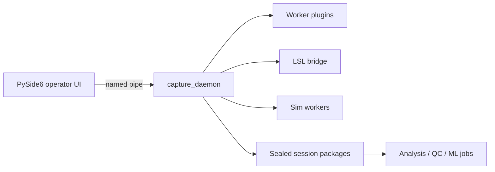

# CaptureSuite

Windows-first multimodal research capture platform: a daemon, versioned worker
plugins, sealed session packages, and a PySide6 operator UI.

> **Platform:** Windows 10 21H2+ x64 only for v1.0. The plugin contract is
> process + named-pipe based so other OSes can be added later without breaking
> plugins.

## Who it's for

Researchers and lab engineers who need **structured multimodal capture** on Windows:
a long-running daemon, drop-in worker plugins (C++ or Python), and **sealed session
packages** for downstream QC / features / pose / ML — without rewriting the core
capture path for every device.

## What you get

- **Daemon** — QPC clock, session FSM, recovery, named-pipe control plane
- **Plugins** — drop in a `plugin.json` + worker executable (C++ or Python SDK)
- **Sim** — develop and demo without hardware
- **LSL bridge** — record any Lab Streaming Layer outlet with zero vendor code
- **Analysis** — QC, features, pose/kinematics, ML bundle jobs on sealed packages

## Architecture (sketch)



## 60-second sim demo

```powershell
# Terminal 1 — build + daemon (once per machine: copy CMakeUserPresets.example.json)
. .\scripts\dev-env.ps1
cmake --preset windows-release
cmake --build build/windows-release --target capture_daemon
.\build\windows-release\daemon\capture_daemon.exe

# Terminal 2 — desktop
cd desktop
& "$env:LOCALAPPDATA\Programs\Python\Python312\python.exe" -m capture_desktop
```

Or use `tools/run-demo.ps1` after a release build.

In the UI: status bar shows **Connected** → **Create Session** → **Rehearse**
or **Start Selected**. Greyed buttons usually mean the daemon is not connected.

## Bring your own device

1. Implement the worker protocol (or subclass `capture_worker.Worker` in Python).
2. Drop `plugins/<your_id>/plugin.json` next to the daemon (or under
   `%LOCALAPPDATA%\CaptureSuite\plugins`).
3. Restart the daemon — sources appear in the Capture rail.

Fast path:

```powershell
.\tools\new_plugin.ps1 -PluginId "lab.force" -DisplayName "Force plate" -Family numeric -Modality force
```

Then paste a template from [docs/prompts/](docs/prompts/) into Cursor.
See [docs/plugins/](docs/plugins/) and
[docs/design/PLUGIN_REGISTRY.md](docs/design/PLUGIN_REGISTRY.md).

## Docs

| Audience | Location |
|----------|----------|
| Product specification | [docs/spec/](docs/spec/) |
| Implementation decisions | [docs/design/](docs/design/) |
| Plugin authors | [docs/plugins/](docs/plugins/) |
| Operators | [docs/operator/](docs/operator/) |
| Agent / contributor rules | [AGENTS.md](AGENTS.md), [CONTRIBUTING.md](CONTRIBUTING.md) |

## Development practice

CaptureSuite is built as **AI-native research software**: architecture, plugin
contracts, and release decisions are human-owned; day-to-day implementation uses
coding agents against in-repo specs (`docs/spec`, `docs/design`), plugin prompts
(`docs/prompts`), and contributor/agent rules (`AGENTS.md`). That is intentional
engineering practice — not a claim that every line was typed by hand, and not a
claim of autonomous “AI-built” product ownership by a model.

## License

CaptureSuite application code is **GPL-3.0**. Schemas, the wire protocol
library, the Python worker SDK, and the C++ stub template are **Apache-2.0** so
you can wrap proprietary vendor SDKs in plugins without viral licensing.
Details: [LICENSING.md](LICENSING.md).

## How to cite

See [CITATION.cff](CITATION.cff). A Zenodo DOI will be added on the first
tagged release.

## Maintainer

**Jacob Scott-Metoyer** ([@Jacob-Met](https://github.com/Jacob-Met)) — architecture
and product direction. Independent research software (not an official product of
any university lab unless separately stated).

