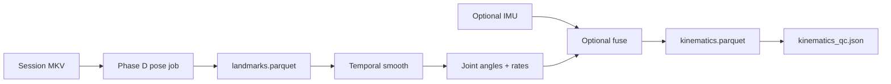

# Kinematics Pipeline — Teacher Labels for Radar ML

Offline pipeline that converts pose (and optional IMU) into **kinematic state targets** for radar-to-kinematics training. Companion to [ANALYSIS.md](ANALYSIS.md) Phase D2 and [PROJECT_OUTLINE.md](../../../docs/PROJECT_OUTLINE.md).

**Rule:** ML targets live in `kinematics.parquet`, not `landmarks.parquet`.

---

## Pipeline overview



| Step | Job | Input | Output |
|------|-----|-------|--------|
| 1 | `pose` (Phase D) | MKV | `pose/landmarks.parquet` |
| 2 | `kinematics` (Phase D2) | landmarks (+ optional IMU) | `kinematics/kinematics.parquet` |
| 3 | `ml_bundle` (Phase E) | radar features + kinematics | `ml_bundle/` |

Default pose backend for teacher labels: **`rtmo_l`** (GPU lab). CPU smoke: `mediapipe_smooth`.

---

## Target tiers

### Tier A — primary ML targets (network head)

Stored in `kinematics.parquet` with `calibrated: bool` per column group.

| Quantity | Column pattern | Units | Frame | Notes |
|----------|----------------|-------|-------|-------|
| Elbow flexion | `theta_elbow_flex_L`, `theta_elbow_flex_R` | deg | Torso-fixed | shoulder–elbow–wrist |
| Shoulder elevation | `theta_shoulder_elev_L`, `theta_shoulder_elev_R` | deg | Torso-fixed | elbow–shoulder–hip |
| Shoulder flexion | `theta_shoulder_flex_L`, `theta_shoulder_flex_R` | deg | Torso-fixed | Derived from landmark geometry |
| Wrist angle | `theta_wrist_L`, `theta_wrist_R` | deg | Forearm | When wrist landmarks valid |
| Angular velocity | `omega_<angle_name>` | deg/s | — | Central diff on smoothed θ |
| Radial segment velocity | `v_radial_upper_arm_L`, `v_radial_upper_arm_R` | m/s | Radar LOS | Requires spatial preset; else NaN |
| Rolling AFR | `afr_<joint>_deg` | deg | — | Kobayashi-compatible window |
| Confidence | `valid_<joint>` | bool | — | Pose conf + angle definable |

Registry: [`schemas/kinematics/kinematics_columns.schema.json`](../../schemas/kinematics/kinematics_columns.schema.json) (schema) and [`kinematics_columns.registry.json`](../../schemas/kinematics/kinematics_columns.registry.json) (column definitions).

### Tier B — derived offline (not direct network head)

Computed in analysis or post-processing; used for reports and optional auxiliary losses.

| Quantity | Notes |
|----------|-------|
| ATD | Integrated path length per joint (px or cm with scale) |
| MA, MR | Mean acceleration / rate metrics (Kobayashi) |
| Linear acceleration | Second derivative of landmark position (smoothed) |
| Jerk | Third derivative |
| Per-activity summaries | Mean/max θ, ω over checkpoint window |

### Tier C — teacher-only (never deployed)

| Data | Location |
|------|----------|
| Raw landmarks `(x, y, z)` | `pose/landmarks.parquet` |
| Native dense pose | `pose/native/<model_id>/` |
| Raw IMU gyro/accel | Session MCAP (not copied to kinematics) |

---

## Angle conventions

Aligned with Kobayashi / [paper_landmarks.py](../../../UrologyMoCap/paper_landmarks.py):

| Angle | Landmarks (MediaPipe index) |
|-------|----------------------------|
| Elbow flexion L/R | 11–13–15 / 12–14–16 |
| Shoulder elevation L/R | 13–11–23 / 14–12–24 |
| Shoulder flexion | Computed in sagittal plane from shoulder–elbow vector vs vertical |

Hips (23, 24) are required for shoulder metrics. Missing hip → shoulder angles masked, not extrapolated.

Full export contract: [KINEMATICS_EXPORT.md](../../../UrologyMoCap/docs/KINEMATICS_EXPORT.md).

---

## Smoothing and differentiation policy

Defaults are **provisional** until validated on CaptureSuite surgical footage.

| Parameter | Default | Rationale |
|-----------|---------|-----------|
| Landmark smooth | Savitzky–Golay, window 11 frames, poly 3 | Matches UrologyMoCap Kobayashi comparison practice |
| Min confidence | 0.25 per landmark | Same as `run_kobayashi_metrics_from_cache.py` |
| Angular velocity | Central difference on smoothed θ | Avoid landmark jitter inflation |
| IMU fusion | Optional weighted blend when Xsens available | IMU ω for arm segment; video for absolute θ |
| Gap policy | `mask` (default) | No interpolation across DISCONNECT or pose dropout |

**Never** differentiate raw unsmoothed landmarks for Tier A velocity targets.

---

## Optional IMU fusion

When M7 Xsens data exists:

1. Resample IMU to analysis grid (record in `AnalysisGrid`).
2. Map segment labels (torso, upper_arm_L/R) via anatomical preset.
3. Use IMU gyro for `omega_*` when segment assignment confident.
4. Use video θ for absolute angle; IMU for high-frequency ω refinement.
5. Record fusion weights in `kinematics_qc.json` → `imu_fusion`.

If IMU absent, all Tier A columns derive from video only.

---

## Job outputs

```text
processing/jobs/<job_id>/kinematics/
  kinematics.parquet       # Tier A + validity flags + session_time_ns
  kinematics_qc.json       # detection rates, masked intervals, fusion notes
  figures/
    angles_<joint>.png
    omega_<joint>.png
```

### Parquet required columns

| Column | Type | Description |
|--------|------|-------------|
| `session_time_ns` | int64 | Master analysis grid timestamp |
| `frame_index` | int64 | Pose frame index (provenance) |
| Tier A θ, ω columns | float64 | NaN when invalid |
| `valid_*` | bool | Per-joint validity |
| `teacher_source` | string | `video` \| `video+imu` |
| `pose_model_id` | string | e.g. `rtmo_l` |

---

## Kobayashi metrics integration

Session-level and windowed Kobayashi metrics (ATD, MS, MA, MR, AFR) are computed via vendored `furs_ergonomic_metrics` (see [FURS_VENDORING.md](../../../UrologyMoCap/docs/FURS_VENDORING.md)).

- **Offline Excel path:** UrologyMoCap `run_kobayashi_metrics_from_cache.py` (pickle caches)
- **CaptureSuite path:** Phase D2 writes compatible columns into `kinematics.parquet` and optional `kinematics/kobayashi_summary.json` per activity window

Live rolling metrics in [realtime_metrics.py](../../../UrologyMoCap/realtime_metrics.py) are a **subset** for demo UI — definitions must match offline where overlapping.

---

## Units honesty

Per [ANALYSIS.md](ANALYSIS.md):

- Pixel-derived velocities before scale calibration: `calibrated: false`, units `px/s`.
- After tape / known `px_per_cm`: `cm/s` with `calibrated: true` documented in QC.
- IMU sim data: `a.u.` until real Xsens validation.

Radar-derived predictions at train time are separate from teacher units — normalize in `ml_bundle`.

---

## CLI (planned)

```bash
python tools/run_analysis.py kinematics <package> \
  --pose-job <job_id> \
  --gap-policy mask \
  --smooth savgol:11:3
```

Requires completed Phase D job referencing `pose/landmarks.parquet`.

---

## Related documents

- [KINEMATICS_EXPORT.md](../../../UrologyMoCap/docs/KINEMATICS_EXPORT.md)
- [DATA_COLLECTION_PROTOCOL.md](DATA_COLLECTION_PROTOCOL.md)
- [ANALYSIS.md](ANALYSIS.md) — Phase D2, E, F
- [PROJECT_OUTLINE.md](../../../docs/PROJECT_OUTLINE.md)
