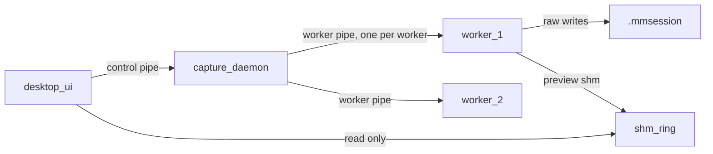

# IPC Protocol

Control and status transport between the desktop UI, the capture daemon, and source workers. Raw capture data never travels over this protocol.

## Topology

The daemon owns all state. The UI is a client and may crash or reconnect at any time without affecting acquisition.

## Transport

Windows named pipes, byte mode (`PIPE_TYPE_BYTE`), overlapped I/O (`FILE_FLAG_OVERLAPPED` on every server instance). Byte mode with explicit framing rather than message mode, so the same framing can later run over TCP without protocol changes.

Overlapped I/O is mandatory, not optional: a synchronous duplex pipe queues a write behind a pending `ReadFile` on the same handle, which means a subscriber that never issues another request receives no unsolicited events. The accept loop also serves each connection on its own thread so a second UI or CLI can attach without waiting for the first to disconnect.

Pipe names:

- Control: `\\.\pipe\capturesuite.{instance_id}.control`
- Worker: `\\.\pipe\capturesuite.{instance_id}.worker.{worker_id}`

`instance_id` is a GUID generated per daemon start and published in `%LOCALAPPDATA%\CaptureSuite\instance.json` so the UI can discover a running daemon.

### Security

Pipes are created with an explicit DACL granting `GENERIC_READ | GENERIC_WRITE` to the creating user SID and `SYSTEM` only. `NULL` DACLs are forbidden. Shared-memory preview segments use the same DACL. The daemon rejects a connection whose peer token SID does not match its own (`GetNamedPipeClientProcessId` then token comparison).

## Framing

Every frame is a 16-byte little-endian header followed by a protobuf payload.

| Offset | Size | Field | Notes |
|---|---|---|---|
| 0 | 4 | magic | ASCII `CSP1` (0x31505343) |
| 4 | 4 | payload_len | bytes of payload, max 8388608 (8 MiB) |
| 8 | 4 | message_type | `capture.v1.MessageType` enum value |
| 12 | 4 | correlation_id | echoed in the reply; 0 for unsolicited events |

Rules:

- A frame with a bad magic terminates the connection immediately and logs `error`
- `payload_len` over the maximum terminates the connection; control messages are small by construction
- Requests carry a nonzero `correlation_id`; replies echo it; events use 0
- Multiple in-flight requests are permitted; replies may arrive out of order

## Versioning and handshake

The first frame on any connection is `Hello`, answered by `HelloAck`. No other message is legal before the handshake completes.

`Hello` carries:

- `protocol_major` / `protocol_minor` — the `capture.v1` wire version
- `VersionInfo` for the sending component (major, minor, patch, git_describe)
- For workers: `plugin_id`, `plugin_version`, `min_daemon_protocol`, `max_daemon_protocol`, and a supported-operations bitmask

Compatibility rules:

- Mismatched `protocol_major` is fatal. The daemon replies `HelloAck` with `accepted=false` and an `ErrorInfo`, then closes.
- A worker whose `[min_daemon_protocol, max_daemon_protocol]` range excludes the daemon's version is rejected before any device is touched.
- Higher `protocol_minor` on either side is accepted. Unknown fields are preserved and ignored, which is what makes minor additions safe.
- The operations bitmask declares optional capabilities (pairing, calibration, arming). The daemon never sends an operation a worker did not advertise.
- `SourceManifest.capabilities["isolation"]` declares `shared` or `per_source` process granularity, per [WORKER_HOST.md](WORKER_HOST.md). Absent means `shared`.

## Message surface

### UI to daemon (`control.proto`)

Session: `CreateSession`, `OpenSession`, `FinalizeSession`
Selection and lifecycle: `ListSources`, `SelectSources`, `StartSelected`, `StartAllReady`, `Stop`
Events: `CreateCheckpoint`, `UpdateCheckpoint`, `Annotate`, `AddSyncAnchor`
Configuration: `GetConfigSchema`, `ApplyConfig` (semantics in [CONFIGURATION_UI.md](CONFIGURATION_UI.md))
Validation: `RunPreflight`, `StartRehearsal`
Status: `SubscribeStatus`, `ListWorkers`, `GetSessionView`
Preview: `ListPreviewDescriptors`, `SetPreviewConfig`
Attention: `AcknowledgeAlert`

### Daemon to worker (`worker.proto`)

Lifecycle: `Identify`, `Discover`, `Connect`, `Disconnect`, `Shutdown`
Optional: `Pair`, `Unpair`, `Calibrate`
Configuration: `GetCapabilities`, `GetConfigSchema`, `ApplyConfig`, `Validate`
Capture: `Arm`, `Start`, `Stop`, `Recover`
Introspection: `GetStreamDescriptors`, `GetHealth`, `GetPreviewDescriptor`

### Worker to daemon (`worker.proto`)

Storage reporting: `SegmentSealed` — a worker sealed and hashed one of its own output files; the daemon appends the `integrity.json` entry and journals `SEGMENT_ROTATED`. See [WORKER_HOST.md](WORKER_HOST.md) for why workers write raw bytes while the daemon owns metadata.

### Unsolicited events (either direction, `correlation_id = 0`)

`StateChanged`, `HealthSnapshot`, `GapEvent`, `OverloadEvent`, `ClockSample`, `LogEvent`, `DiskStatus`, `Alert`, `PreviewFrame`

## Timeouts, heartbeats, liveness

| Parameter | Value |
|---|---|
| Connect timeout | 5 s |
| Default request timeout | 10 s |
| `Connect` / `Pair` / `Calibrate` timeout | 60 s |
| Heartbeat interval | 1 s |
| Missed heartbeats before dead | 3 (so 3 s detection) |
| Shutdown grace period | 5 s, then `TerminateProcess` |
| Reconnect backoff | 250 ms doubling to 4 s cap, jitter plus or minus 20 percent |

Heartbeats are `HealthSnapshot` events; a worker producing health is by definition alive, so there is no separate ping.

When a worker is declared dead during recording, the daemon records the exact session time, closes that source's segment, opens a `DISCONNECT` gap, and leaves every other source untouched.

## Process lifecycle and orphan prevention

The daemon creates a Windows Job Object with `JOB_OBJECT_LIMIT_KILL_ON_JOB_CLOSE` and assigns every worker to it. If the daemon dies for any reason, Windows terminates the workers. This is what prevents orphaned processes holding vendor devices or file handles.

Deterministic shutdown sequence, in order: stop accepting new requests, `Stop` all recording sources, flush and close writers, journal the finalization state, send `Shutdown` to each worker, wait the grace period, terminate stragglers, close the job object.

Spawn ordering, process granularity, and supervision are in [WORKER_HOST.md](WORKER_HOST.md).

## Backpressure policy

Two paths per worker with deliberately different guarantees.

### Preview path

Droppable and latest-wins in every transport. Preview loss is normal, is not an error, and is never journaled.

**Current:** preview payloads travel as unsolicited `PreviewFrame` events on the control pipe after `SubscribeStatus`, latest-wins in the daemon before the send. Wire protocol minor is `4` (adds worker `SegmentSealed` / `SegmentSealedAck` for out-of-process video segments).

**Target:** a 3-slot shared-memory ring carrying byte-identical `PreviewFrame` payloads. Layout, publish protocol, and the measured criteria that trigger the cutover are in [PREVIEW_TRANSPORT.md](PREVIEW_TRANSPORT.md).

### Raw path

Bounded queue per stream, sized to 2 seconds of nominal data. The acquisition callback never blocks, because blocking a vendor SDK callback is how you lose data or deadlock the SDK.

| Stream class | Example | Nominal rate | Queue capacity | Batch flush |
|---|---|---|---|---|
| Sampled, high rate | EMG 16 ch at 2 kHz | 128 KB/s | 256 KB | 50 ms |
| Structured, low rate | 7 IMUs at 100 Hz | 45 KB/s | 128 KB | 100 ms |
| Array frame | radar, 12 KB frames at 30 Hz | 360 KB/s | 1 MB | 1 frame |
| Frame | 1080p60 encoded video | 20 MB/s | 8 frames | per frame |

Thresholds:

- At 75 percent occupancy: emit one `OverloadEvent` (rate-limited to one per second per stream) and log `warn`
- At 100 percent: drop the incoming datum, increment the drop counter, and open or extend an `OVERLOAD_DROP` gap

Dropping is always reported. Silent loss on the raw path is a defect.
