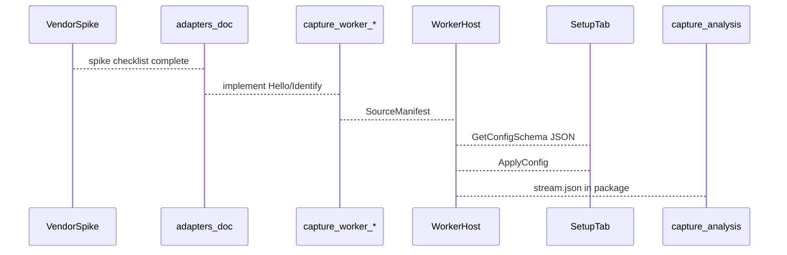

# Acquisition plugin contract

Research date: **2026-09-01**  
Status: **Normative sketch** — aligns with [WORKER_HOST.md](../WORKER_HOST.md), [PROTOCOL.md](../PROTOCOL.md), [CONFIGURATION_UI.md](../CONFIGURATION_UI.md).

**Goal:** A new hardware or sim family integrates without editing daemon core session code.

---

## 1. Integration path



1. Complete [VENDOR_SPIKE.md](../VENDOR_SPIKE.md) → fill `docs/design/adapters/<vendor>.md`.
2. Ship worker executable (or in-daemon sim with explicit `sim.*` type).
3. Publish protobuf record schema + JSON schema revision.
4. Register analysis loader + feature extractor (Track E).
5. Add modality scorecard under `docs/design/research/MODALITY_DEPTH_*.md`.

---

## 2. SourceManifest requirements

| Field | Rule |
|-------|------|
| `source_id` | Stable across sessions (UUID/hash), not alias |
| `source_type` | Namespaced: `vendor.product` or `sim.emg` |
| `modality` | Open enum — core maps to UI lane color |
| `capabilities.families` | Declares UI grouping |
| `capabilities.isolation` | `per_source` \| `shared` |
| `streams[]` | One or more `StreamDescriptor` |

---

## 3. StreamDescriptor requirements

| Field | Rule |
|-------|------|
| `data_schema_id` | Versioned: `domain.name/revision` |
| `nominal_rate_hz` | Required; missing fails analysis jobs |
| `units` | SI or honest `a.u.` |
| `timestamp_source` | `device` \| `host` \| `hybrid` — documented uncertainty |
| `stream_class` | `continuous` \| `segmented` \| `event` |

---

## 4. Preview contract

| Rule | Detail |
|------|--------|
| Kind | One of [UI_CONTRACT.md](../UI_CONTRACT.md) preview kinds or propose new kind with schema bump |
| Rate | Worker-side decimation; droppable |
| Size caps | Respect max payload bytes in PROTOCOL |
| Never record | Preview payloads must not be written as raw substitute |

---

## 5. Configuration contract

| Deliverable | Format |
|-------------|--------|
| `GetConfigSchema` | JSON Schema + `schema_revision` string |
| Hints | `x-capture-group`, `x-capture-order`, `x-capture-units`, `x-capture-restart-required` |
| Apply | Atomic per source; blocked during RECORDING |
| Effective config | Daemon returns coercion list |

---

## 6. Record path

| Rule | Detail |
|------|--------|
| Writer | Worker or daemon proxy per WORKER_HOST — never GUI |
| Segments | Sealed with integrity hash |
| Gaps | DISCONNECT explicit in gaps.jsonl |
| Config snapshot | `configuration_hash` in stream.json when params affect bytes |

---

## 7. Analysis hooks (registration)

On package seal, analysis discovers via `stream.json` only.

New modality registers:

```yaml
# analysis_plugins/manifest.yaml (proposed)
loaders:
  - schema_id: force.frame/1
    entry: capture_analysis_plugins.force:load_force
features:
  - id: force.cop.v1
    schemas: [force.frame/1]
    entry: capture_analysis_plugins.force:extract_cop
plots:
  - id: plot.force.cop_path
    entry: capture_analysis_plugins.force:plot_cop_path
```

See [ANALYSIS_PLUGIN_ARCHITECTURE.md](ANALYSIS_PLUGIN_ARCHITECTURE.md).

---

## 8. Sim vs production honesty

| Prefix | UI badge |
|--------|----------|
| `sim.*` | “Simulated” |
| `radar.<uuid>` | Hardware UUID truncated |
| Vendor | Vendor + model |

Sim must not claim calibrated units unless explicitly configured.

---

## 9. Checklist for plugin author

- [ ] Adapter doc complete  
- [ ] Protobuf + JSON schema in `schemas/`  
- [ ] Worker passes Hello handshake tests  
- [ ] Soak test script in `tools/`  
- [ ] Modality scorecard written  
- [ ] Analysis loader + ≥1 feature + ≥1 plot registered  
- [ ] Preview painter or reuse existing kind  
- [ ] Preflight checks documented  

---

## 10. References

- [EXTENSION_MODALITIES.md](EXTENSION_MODALITIES.md)
- [SESSION_FORMAT.md](../SESSION_FORMAT.md)
- [AGENTS.md](../../../AGENTS.md)
