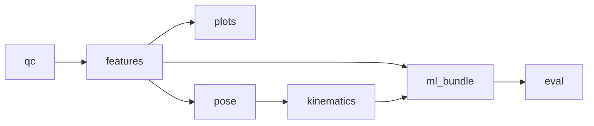

# Analysis plugin architecture

Research date: **2026-09-01**  
Status: **Architecture decision record**

**Problem:** [`pipeline.py`](../../libs/python/capture_analysis/capture_analysis/pipeline.py) hard-codes modality dispatch. Third-party extractors require fork.

**Decision:** **In-tree YAML manifest** as primary registry + optional **setuptools entry points** for external lab plugins. Version: `analysis_plugin_manifest/1`.

---

## 1. Registry comparison

| Approach | Pros | Cons | Verdict |
|----------|------|------|---------|
| Edit pipeline.py | Simple | Not scalable | Reject |
| Decorator registry | Pythonic | Import side effects | Internal only |
| YAML manifest | Reviewable, no import until run | Needs loader | **Primary** |
| Entry points | pip-installable plugins | Discovery/debug harder | **Secondary** |

---

## 2. Core ABCs (sketch)

```python
class StreamLoader(Protocol):
    schema_id: str
    materialize_policy: Literal["stream", "materialize", "forbidden"]

    def load(self, ref: StreamRef, window: TimeWindow, *, max_ram_bytes: int) -> LoadedStream: ...

class FeatureExtractor(Protocol):
    feature_id: str
    schema_ids: list[str]
    params_schema: dict  # JSON Schema

    def extract(self, loaded, gap_mask: GapMask, params: dict) -> FeatureResult: ...

class PlotRenderer(Protocol):
    plot_id: str
    input_kinds: list[str]  # feature_parquet, derived_npy, ...

    def render(self, inputs: dict, out_path: Path, style: PlotStyle) -> None: ...

class AnalysisJob(Protocol):
    command: str
    depends_on: list[str]  # e.g. kinematics -> ["pose"]

    def run(self, package: Path, work: Path, params: JobParams, ctx: JobContext) -> JobResult: ...

class Formula(Protocol):
    formula_id: str
    tier: Literal["A", "B"]
    inputs: list[str]  # column ids

    def compute(self, df: pd.DataFrame, params: dict) -> pd.Series: ...
```

---

## 3. Manifest layout

```
libs/python/capture_analysis/
  capture_analysis/
    plugins/
      manifest.yaml          # bundled plugins
      registry.py            # load + validate
  capture_analysis_plugins/  # optional external package template
```

Example manifest entry:

```yaml
features:
  - id: emg.envelope.v1
    schema_ids: [emg.batch/1]
    module: capture_analysis.features.emg
    function: extract_emg_features
    params_schema: schemas/analysis/emg_envelope_params.schema.json
```

---

## 4. Job DAG



`jobs.run()` becomes:

1. Resolve command closure (all dependencies).
2. Validate prior artifacts exist or run deps in order.
3. Write unified `job_manifest.json` with `dependsOnJobs[]`.

Extended schema: [schemas/analysis_job_dag.schema.json](schemas/analysis_job_dag.schema.json).

---

## 5. AnalysisGrid engine

Replace stub [`grids.py`](../../libs/python/capture_analysis/capture_analysis/grids.py):

| Method | Use |
|--------|-----|
| `native` | No resample — per-stream native grids |
| `linear` | Interpolate to common axis (pose gaps masked) |
| `previous` | Hold-last-value for slow labels |
| `window_mean` | Radar feature bins |
| `sync_anchor_offset + linear_interp` | Phase E ML bundle |

Provenance fields on grid:

- `method`, `params`, `sourceStreams`, `anchorIds[]`, `createdUtc`

**Rule:** No interpolation across DISCONNECT gaps ([ANALYSIS.md](../ANALYSIS.md)).

Implement `apply_sync_anchors` in grid builder ([ANALYSIS_SCOPE_SEMANTICS.md](ANALYSIS_SCOPE_SEMANTICS.md)).

---

## 6. Add a feature in 5 files (example)

| # | File | Action |
|---|------|--------|
| 1 | `features/my_modality.py` | Implement `FeatureExtractor` |
| 2 | `loaders/my_modality.py` | Implement `StreamLoader` |
| 3 | `plugins/manifest.yaml` | Register ids |
| 4 | `schemas/analysis/my_params.schema.json` | Params schema |
| 5 | `tests/analysis/test_my_modality.py` | Analytic fixture |

No edit to `pipeline.py` — dispatcher reads manifest.

---

## 7. Trust model

| Tier | Mechanism |
|------|-----------|
| Bundled | Shipped in repo, CI tested |
| Lab plugins | `plugins.local.yaml` + explicit enable in settings |
| External pip | Entry point group `capture_analysis.plugins` + version pin |

No silent auto-load from internet. Closed-source allowed with operator acknowledgment.

---

## 8. Reproducibility

`job_manifest.json` adds:

```json
{
  "environmentHash": "sha256:…",
  "pluginManifestVersion": "1.0.0",
  "pluginIds": ["emg.envelope.v1", "radar.rd_energy.v1"]
}
```

Environment hash: Python version + installed extras from `pyproject.toml` optional groups.

---

## 9. Graph type registry

Plot kinds registered separately:

| plot_id | Inputs | Renderer |
|---------|--------|----------|
| `trace.multi` | feature_parquet | PyQtGraph |
| `heatmap.rd` | derived_npy | PyQtGraph |
| `pose.overlay` | pose parquet + video | matplotlib/ffmpeg |
| `scatter.ml_residual` | eval tables | matplotlib |

See [FEATURE_CATALOG_RESEARCH.md](FEATURE_CATALOG_RESEARCH.md).

---

## 10. References

- [FEATURE_CATALOG_RESEARCH.md](FEATURE_CATALOG_RESEARCH.md)
- [schemas/analysis_plugin_manifest.schema.json](schemas/analysis_plugin_manifest.schema.json)
- [ANALYSIS.md](../ANALYSIS.md)
