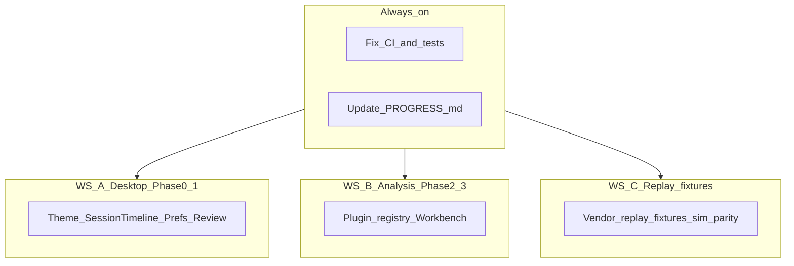

# Autonomous execution plan

Research date: **2026-09-01**  
Purpose: Enable agents to **implement, debug, test, and extend research** without operator intervention. Development proceeds on **simulators, sealed fixtures, and replayable recorded data** — physical hardware is validation only, and comes **last**.

**Upstream:** [Full-stack research index](README.md) → [IMPLEMENTATION_ROADMAP_FROM_RESEARCH.md](IMPLEMENTATION_ROADMAP_FROM_RESEARCH.md)  
**Progress log:** [PROGRESS.md](PROGRESS.md) (agents update each session)

---

## 0. Development philosophy

### Simulation-first (default path)

The app **does not need hardware on the bench** to advance. Treat every modality as developable offline:

| Need | Use instead of hardware |
|------|-------------------------|
| Live acquisition IPC | Sim workers + daemon soak on fixtures |
| Stream shapes / rates | Contract + sim; extend sim when spike docs define batch layout |
| Analysis pipelines | `tests/fixtures/mini_session`, sealed `.mmsession`, local captures |
| Long-session stress | Replay or sim at contract rate; nightly soak scripts |
| Vendor-specific quirks | Download or ingest **recorded vendor exports** as replay fixtures when available |

**Physical device interaction is the very last step** — for confirming assumptions already implemented against sim/replay, not for unblocking feature work. Never stop Phase 0–6 implementation waiting for an operator to plug in a device.

### Industry-quality bar (cross-cutting)

Every phase must move the product toward **professional lab-instrument quality** on three layers. This is not deferred to “polish at the end.”

| Layer | What “industry level” means | Primary specs |
|-------|-----------------------------|---------------|
| **Machine** | Predictable resource use, no silent degradation, recoverable failures, measurable SLOs | [PERFORMANCE_SLO_RESEARCH.md](PERFORMANCE_SLO_RESEARCH.md), soak scripts, diagnostic bundles |
| **Presentation** | Coherent visual system, dense but readable UI, no milestone/demo chrome in shipping surfaces | [DESIGN_SYSTEM.md](../DESIGN_SYSTEM.md), [COMPETITIVE_AUDIT.md](COMPETITIVE_AUDIT.md) checklist |
| **Operator use** | Clear IA, honest data state, protected destructive actions, export provenance, learnable workflows | [IA_AND_PRODUCT.md](IA_AND_PRODUCT.md), [ETHICS_AND_PRIVACY.md](ETHICS_AND_PRIVACY.md), [OPERATOR_AND_PLUGIN_DOCS_OUTLINE.md](OPERATOR_AND_PLUGIN_DOCS_OUTLINE.md) |

**Per-phase quality gate (in addition to functional gate):**

- No new UI without theme tokens / spacing from design system.
- No feature marked `hardware_validated` without a tagged fixture ([FEATURE_CATALOG_RESEARCH.md](FEATURE_CATALOG_RESEARCH.md)).
- Performance regressions in touched paths → measure and fix or document SLO exception.
- User-visible errors must be actionable (what failed, what to do), not stack traces in the shell.

---

## 1. Agent authority

### Proceed autonomously

- Implement Phases 0–6 on **sim + fixtures + replay** per roadmap.
- Fix build/test/CI failures in touched areas.
- Run analysis jobs on `tests/fixtures/mini_session` and local sealed packages.
- Build EMG/IMU/radar workers against **sim and recorded replay**; tag outputs `provisional` until hardware validation pass.
- Write/adjust **research notes** when discovery changes a pinned decision (record reason in doc).
- Refactor within scope of current phase gate.
- Stop stray daemons/workers before builds; re-run soak scripts locally.
- Apply the **industry-quality bar** (§0) on every touched surface.

### Stop and document (do not guess)

| Gate | Action |
|------|--------|
| **Physical hardware on bench** | **Last resort only** — never blocks sim/replay implementation; log validation TODO in PROGRESS, continue other work |
| Claiming `hardware_validated` in manifest/UI | Requires tagged fixture + completed spike checklist; until then stay `provisional` |
| Multi-radar **hardware** sync claim in product copy | Software-coordinated only until board validation |
| Kobayashi Tier B | Block on `furs_ergonomic_metrics` license — ship Tier A only |
| Product-level fork (web UI, drop PySide6) | Record in research + ask operator |
| IRB/consent policy change | Update [ETHICS_AND_PRIVACY.md](ETHICS_AND_PRIVACY.md) only |
| **Hand tracker bake-off / UrologyMoCap hand benchmarks** | **Deferred by operator (2026-09-01)** — do not run until explicitly re-enabled in [PROGRESS.md](PROGRESS.md) |

When blocked on product/legal gates: append **Blockers** in [PROGRESS.md](PROGRESS.md), skip to next parallel workstream, continue. **Hardware absence is not a blocker.**

---

## 2. Environment

```powershell
# C++ / daemon (once per shell)
cd <repo-root>
. .\scripts\dev-env.ps1
# Copy CMakeUserPresets.example.json → CMakeUserPresets.json for local camera/radar
cmake --preset windows-release-local
cmake --build build/windows-release

# Python 3.12 (tests, analysis)
$py = "$env:LOCALAPPDATA\Programs\Python\Python312\python.exe"
$ruff = "$env:LOCALAPPDATA\Programs\Python\Python312\Scripts\ruff.exe"
```

| Component | Path / note |
|-----------|-------------|
| Repo | Clone root of this repository |
| GStreamer daemon | `tools\run-daemon-gstreamer.ps1` |
| Camera worker | `build\windows-release\plugins\camera_gstreamer\capture_worker_camera.exe` (after B5 layout) |

**Before any link:** ensure no `capture_daemon` / `capture_worker_*` holding exe (LNK1168).

---

## 3. Verification loop (every change)

Run the **narrowest** superset that covers touched code:

```powershell
# Python analysis / session libs
& $py -m pytest tests/analysis -q
& $py -m pytest tests/protocol -q

# Lint touched Python
& $ruff check libs/python/capture_analysis desktop/capture_desktop tools/run_analysis.py

# C++ (if daemon/workers/schemas changed)
cmake --build build/windows-release
# Optional targeted:
# ctest --test-dir build/windows-release -R <pattern> --output-on-failure
```

### Phase gates (automated)

| Phase | Gate command / check |
|-------|----------------------|
| 0 | Desktop launches; theme toggles; SessionTimeline renders on mini fixture |
| 1 | Export wizard produces checkpoint-scoped folder + sidecar on `tests/fixtures/mini_session` |
| 2 | Dummy manifest plugin runs without editing `pipeline.py`; `tests/analysis/test_plugin_*.py` green |
| 3 | Analysis tab shows PyQtGraph sync dashboard; no `os.startfile` for plots job |
| 4 | Modality scorecard row ≥4/5 for implemented family |
| 5 | `run_analysis.py pose` on session with MKV; `landmarks.parquet` validates |
| 6 | `ml_bundle` manifest validates against schema |

---

## 4. Workstreams (parallel)



**Default priority when unsure:** CI green → Phase 0 (incl. design-system quality) → Phase 2 (plugins unlock everything) → Phase 1 → Phase 3 → Phase 4 sim/replay tracks → soak/SLO hardening → **hardware validation last**.

**Out of scope until operator re-enables:** UrologyMoCap hand tracker bake-off, `benchmark_hand_models.py` sweeps, overlay strip salvage.

---

## 5. Phase execution checklist

### Phase 0 — Foundation

| Step | Spec | Files |
|------|------|-------|
| 0.1 | [DESIGN_SYSTEM.md](../DESIGN_SYSTEM.md) | `desktop/capture_desktop/theme.py` |
| 0.2 | [IA_AND_PRODUCT.md](IA_AND_PRODUCT.md) SessionHeader | `widgets_session_header.py`, `widgets_session_timeline.py` |
| 0.3 | [COMPETITIVE_AUDIT.md](COMPETITIVE_AUDIT.md) chrome | `app.py` |
| 0.4 | [PRESETS_AND_SETTINGS_UX.md](PRESETS_AND_SETTINGS_UX.md) | `screen_settings.py` |
| 0.5 | [ETHICS_AND_PRIVACY.md](ETHICS_AND_PRIVACY.md) banners | `screen_review.py`, capture dock |

**Debug:** Qt styles — verify light/dark on all tabs; check `settings.json` persistence.

### Phase 1 — Review + export

| Step | Spec | Files |
|------|------|-------|
| 1.1 | [REVIEW_AND_EXPORT_UX.md](REVIEW_AND_EXPORT_UX.md) layout | `screen_review.py` |
| 1.2 | Export matrix | `export_wizard.py`, extend `tools/export_session.py` |
| 1.3 | Recovery UX | link `session_doctor`, recovered banner |

### Phase 2 — Analysis plugins

| Step | Spec | Files |
|------|------|-------|
| 2.1 | [ANALYSIS_PLUGIN_ARCHITECTURE.md](ANALYSIS_PLUGIN_ARCHITECTURE.md) | `capture_analysis/plugins/` |
| 2.2 | Manifest migrate | `plugins/manifest.yaml`, retire `pipeline.py` elif |
| 2.3 | AnalysisGrid | `grids.py`, wire `apply_sync_anchors` |
| 2.4 | Job DAG | `jobs.py`, extend job manifest schema |

**Debug:** Job fails — read `processing/jobs/<id>/logs/job.log`; validate manifest against schema.

### Phase 3 — Analysis workbench

| Step | Spec | Files |
|------|------|-------|
| 3.1 | [ANALYSIS_WORKBENCH.md](ANALYSIS_WORKBENCH.md) | refactor `screen_analysis.py` |
| 3.2 | PyQtGraph | `widgets_analysis_plots.py`, add dependency to `desktop/pyproject.toml` |
| 3.3 | Scope binding | [ANALYSIS_SCOPE_SEMANTICS.md](ANALYSIS_SCOPE_SEMANTICS.md) |

### Phase 4–6

Follow [IMPLEMENTATION_ROADMAP_FROM_RESEARCH.md](IMPLEMENTATION_ROADMAP_FROM_RESEARCH.md). EMG/IMU workers ship on **sim + replay fixtures first**; spike docs define shapes — hardware bench pass is Phase 8 validation, not a dev gate.

---

## 6. Debugging playbooks

### 6.1 Daemon / IPC

| Symptom | Check | Fix |
|---------|-------|-----|
| UI cannot connect | `capture_daemon` running? pipe ACL? | `tools/run-daemon-gstreamer.ps1`; restart |
| Source missing | ListSources RPC | rescan; worker exe on PATH |
| Record won't start | Preflight failures | logs in diagnostic bundle [OPERATIONS.md](../OPERATIONS.md) |
| Stop ignored | Protected stop token | UI must pass token from daemon |

### 6.2 Camera worker

| Symptom | Check | Fix |
|---------|-------|-----|
| `unknown target capture_worker_camera` | CMake preset | `windows-release-local` preset |
| LNK1168 | Daemon holding exe | stop processes |
| No MKV | GStreamer PATH | `GSTREAMER_1_0_ROOT_MSVC_X86_64` |
| MF timing-only | `CAPTURE_USE_CAMERA_WORKER=0` | enable worker + env |

### 6.3 Analysis jobs

| Symptom | Check | Fix |
|---------|-------|-----|
| `NotImplementedError pose` | Expected until Phase 5 | implement per roadmap |
| Empty features | Stream discovery | `stream.json`, modality prefix |
| RAM fail | EMG materialize | raise `max_ram_bytes` or stream windows |
| Wrong time range | Scope params | [ANALYSIS_SCOPE_SEMANTICS.md](ANALYSIS_SCOPE_SEMANTICS.md) |

### 6.4 Desktop / Qt

| Symptom | Check | Fix |
|---------|-------|-----|
| Preview black | Payload kind mismatch | [UI_CONTRACT.md](../UI_CONTRACT.md) |
| Freeze on job | QThread blocking | worker pattern in `screen_analysis.py` |
| Theme not applied | `settings.theme` ignored | Phase 0.1 |

### 6.5 UrologyMoCap / GPU (Phase 5 pose only)

Use when implementing **CaptureSuite Phase D body pose** — not for hand bake-off (deferred).

| Symptom | Check | Fix |
|---------|-------|-----|
| CUDA not used | onnxruntime CPU shadowing | uninstall CPU `onnxruntime`; use GPU venv |

**Overlay salvage / hand tracker bake-off:** **Out of scope** until operator re-enables in [PROGRESS.md](PROGRESS.md).

---

## 7. Additional research triggers

Write or update a research doc **before** coding when:

| Trigger | Output |
|---------|--------|
| New modality | [EXTENSION_MODALITIES.md](EXTENSION_MODALITIES.md) + [ACQUISITION_PLUGIN_CONTRACT.md](ACQUISITION_PLUGIN_CONTRACT.md) checklist |
| New feature extractor | Row in [FEATURE_CATALOG_RESEARCH.md](FEATURE_CATALOG_RESEARCH.md) + manifest entry |
| UI IA change | Update [IA_AND_PRODUCT.md](IA_AND_PRODUCT.md) with reason |
| Performance regression | [PERFORMANCE_SLO_RESEARCH.md](PERFORMANCE_SLO_RESEARCH.md) measurement + SLO proposal |
| Teacher model change | [POSE_HAND_TEACHER_POLICY.md](POSE_HAND_TEACHER_POLICY.md) + benchmark numbers |
| Contradicts pinned design doc | Edit pinned doc with **Decision** section — never silent drift |

Template for ad-hoc research: `docs/design/research/notes/YYYYMMDD_<topic>.md`.

---

## 8. UrologyMoCap hand bake-off — **DEFERRED**

**Operator directive (2026-09-01):** Do not run hand tracker benchmarks, `benchmark_hand_models.py`, or related UrologyMoCap sweeps until re-enabled in [PROGRESS.md](PROGRESS.md).

When re-enabled, use decision clips `5714`, `6517`, `6612` per [POSE_HAND_TEACHER_POLICY.md](POSE_HAND_TEACHER_POLICY.md). Phase 5 may still port **body** pose (`rtmo_l`) from UrologyMoCap without completing hand bake-off.

---

## 9. Vendor spikes (docs + replay first; hardware last)

For Delsys / Xsens / other vendors, agent proceeds **without** a device:

1. Fill adapter doc template from [VENDOR_SPIKE.md](../VENDOR_SPIKE.md) from public SDK docs and sample exports.
2. Add `tools/vendor_spike/<vendor>/` ingest/replay scripts for downloaded sample files.
3. Extend sim worker to emit matching batch shapes and timestamps.
4. Implement worker backend against replay path; tag features `provisional`.

**Hardware bench (last):** When a device is eventually available, run parity checklist only — compare replay vs live; flip `provisional` → `hardware_validated` on passing fixtures. Until then, **never block** other phases.

---

## 10. Session hygiene (PROGRESS.md)

At **start** of each agent session:

1. Read [PROGRESS.md](PROGRESS.md) — current phase, blockers, last green tests.
2. Read git status — don't fight in-progress operator work.

At **end** of each agent session:

1. Update PROGRESS: phase, completed steps, test commands run, blockers.
2. If architecture changed: link research note or design doc PR section.

---

## 11. Decision log format

When changing a pinned decision:

```markdown
## Decision YYYY-MM-DD: <title>
**Reason:** …
**Alternatives rejected:** …
**Files:** …
```

Add to the relevant design doc or `research/notes/`.

---

## 12. Risk register (standing)

| Risk | Mitigation |
|------|------------|
| Plugin registry half-migrated | Phase 2 gate: no new `pipeline.py` elif |
| PyQtGraph dep weight | Optional extra in desktop pyproject |
| Long GPU jobs | Run overnight; log to `data/benchmark_output/` |
| Sim ≠ real EMG/IMU | Features marked `provisional`; replay fixtures narrow gap before hardware |
| Quality bar skipped for speed | Each phase gate includes presentation + operator checklist items |
| Registry.sqlite treated as truth | UI always opens package by path |

---

## 13. Success definition (autonomous program)

The autonomous program is **complete** when:

1. Phases 0–3 shipped and gated (functional + industry-quality checklist per §0).
2. Phase 4 complete for all modality families on **sim/replay** (scorecards ≥4/5).
3. Phase 5 **body** pose job on sealed session (hand 21-pt / bake-off deferred).
4. Phase 6 ML bundle path green on fixture sessions.
5. Soak/SLO scripts pass on lab reference PC per [PERFORMANCE_SLO_RESEARCH.md](PERFORMANCE_SLO_RESEARCH.md).
6. All CI green; PROGRESS shows no unresolved non-product blockers.
7. Operator manual draft exists per [OPERATOR_AND_PLUGIN_DOCS_OUTLINE.md](OPERATOR_AND_PLUGIN_DOCS_OUTLINE.md).

**Hardware validation pass** (optional follow-on, not part of “complete”): bench parity for EMG/IMU/radar when devices available.

---

## 14. Quick command reference

```powershell
# Analysis smoke
& $py tools/run_analysis.py tests/fixtures/mini_session all

# Daemon + desktop (manual validation)
. .\scripts\dev-env.ps1
.\tools\run-daemon-gstreamer.ps1   # terminal 1
& $py -m capture_desktop            # terminal 2 (from desktop/)

# Session doctor
& $py tools/session_doctor/session_doctor.py <path-to.mmsession>

# Radar probe
& $py tools/probe_radar_worker.py
```

---

## 15. References

- [AGENTS.md](../../../AGENTS.md)
- [IMPLEMENTATION_ROADMAP_FROM_RESEARCH.md](IMPLEMENTATION_ROADMAP_FROM_RESEARCH.md)
- [.cursor/rules/local-toolchain.mdc](../../../.cursor/rules/local-toolchain.mdc)
