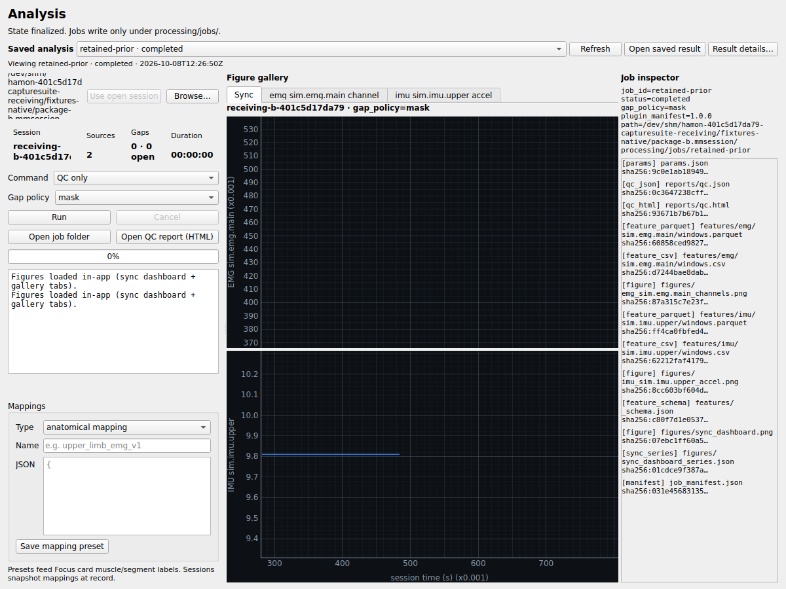
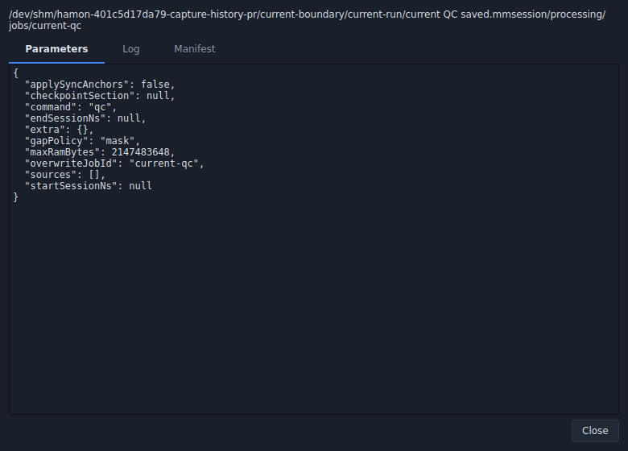
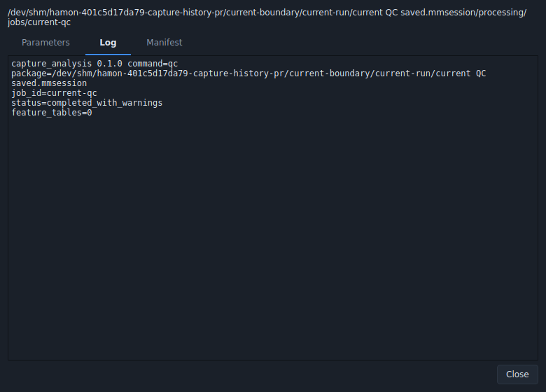

# Saved analysis history — issue 55

Researchers can reopen analysis already saved inside a selected `.mmsession`
package, inspect its original parameters and log, and move between packages
without leaving figures from the previous package on screen. This completes the
saved-result history and details portion of the existing workbench plan.

## Source and scope

Author: `estate-401c5d17da79 / production_discovery`.
Independent native receiver: `estate-401c5d17da79 / estate_coordination`.
Coordination: [CaptureSuite #55](https://github.com/Jacob-Met/CaptureSuite/issues/55).

The genuine authored parent is
`72c15d6b623e217291a824e4e4808a385df896a9` (tree
`221cf5c7bb3c3392a7c4186ba0bcf5a8664135d1`). The first feature commit is
`c0b5530c03cce3e42a0430e5411cddf1df716e19`; the accepted runtime successor is
`37443f0d4d5ffa684b5423d58501856cadbe0655` (tree
`3b3184b931a2aaf91beec36c953bff909a77f2f5`). Subsequent documentation and
current-parent composition commits retain these runtime file hashes.

Production changes comprise a read-only `analysis_history.py` reader, a native
`widgets_analysis_history.py` picker/details window, and small screen hooks.
The existing worker class, signal wiring and thread cleanup remain unchanged;
gallery/inspector implementations, analysis handlers and job-writing formats
remain unchanged. History refreshes during successful or failed result delivery.
Package-bound result selection and a fresh manifest read at Open prevent a
cached selection from opening a disappeared or foreign result.

The time/source/checkpoint UI in #53, preceding-section resolver in #54 and job
provenance writer in #46 retain their separate owners. Existing #48 destination,
replacement and failure-note behavior is preserved.

## What ran

| Qualification | Result | Exact evidence |
| --- | --- | --- |
| Canonical original source | A retained real QC job exists, but reopening its package exposes no history control; the existing inspector can read it when called directly | `author/baseline-receipt.json` |
| Original package lifetime control | Real A figures remain visible after selecting B; an actual late A QC completion binds under B | `independent/baseline-receipt.json` |
| Authored native tests plus retained UI tests | **14 passed**, no skips, 3.21 seconds | `author/author-correction.log` |
| Independent full native receiving | **19 checks passed**, exit 0, 0.914 seconds | `independent/native-candidate-receipt.json` |
| Native details visual check | Parameters/log tabs are readable; selected current-QC/2 package bytes unchanged and no worker started | `visual/details-visual-receipt.json` |

The eight new tests use real completed and failed jobs, copied packages, malformed
and foreign manifests, missing/long saved details, explicit refresh/open actions,
and genuine successful and failed QThreads. The six retained tests cover the
existing workbench, linked plot output and failure-note/cancellation behavior.
Ruff and source whitespace checks pass for all changed production/test files.

The independent receiver generates actual EMG/IMU protobuf MCAP and saved native
figures. It reopens two real PNG and two linked plots, switches between distinct
sessions with the same job name, refuses unavailable/foreign results, revalidates
a manifest removed after selection, and delays delivery of a genuinely completed
QC job while switching packages. Its native `QApplication.exec()` and `QTimer`
state machine confirms that saved/raw/source bytes stay unchanged during viewing
and late delivery. Exact methods and helpers are retained under
`independent/methods/`; they preserve their original bounded workspace paths for
audit. The receiver also preserves its complete fixture packet separately.

## Retained unsuccessful attempts

Manual `processEvents()` / `QTest.qWait()` pumping is not used as the accepting
worker-lifecycle gate. The first authored polling test timed out during a cold
import and aborted while its fixture deleted a running worker. The independent
first candidate similarly crashed after 15 manual-pump checks; a genuine
application-event-loop control of the same runtime passed five checks. A later
manual-pump run stalled and was stopped with exit 130. These outcomes and raw
traces remain in `author/harness-observations.json` and `independent/`; they do
not establish a native application defect. The accepted full receiving uses the
application event loop. No further worker-lifecycle workaround was introduced.

A transient shared-filesystem exhaustion left one attempted author's stdout,
XML and process receipt empty. No test result is claimed for that attempt, and
no other worker's files were removed. The subsequent retained logs identify the
successful exact runs.

## Replay and boundaries

With the project's Python 3.12 desktop/analysis dependencies already installed,
run from the repository root with an isolated Qt platform and application state:

```sh
QT_QPA_PLATFORM=offscreen python -m pytest \
  tests/ui/test_analysis_history.py \
  tests/ui/test_analysis_workbench.py \
  tests/ui/test_analysis_failure_notes.py -q -ra
```

Qualification used Python 3.12.14 and PySide6 6.11.2 on native Linux with the
offscreen Qt platform. It covers this offline UI flow, not Windows CI, the full
desktop/daemon product, physical hardware or clinical validity. The Mac copy is
source/evidence custody only. Current-main QC/2 composition is independently
qualified in the receiving successor and does not replace the authored pins.

`artifact-manifest.json` records the exact retained file hashes. The details and
gallery captures are actual reviewed native frames:

The unchanged repository license gate required SPDX headers on the copied
author baseline and visual scripts. `publication-method-adjustments.json`
records their original and publication hashes; only the leading license comment
was added. The exact originally executed bytes remain in commit `1ce96118` and
its immutable source/evidence packet. Runtime and test files did not change.






