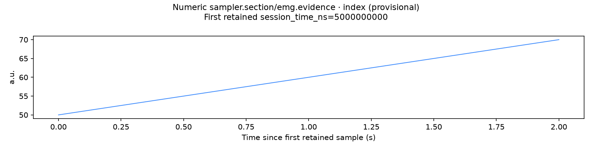
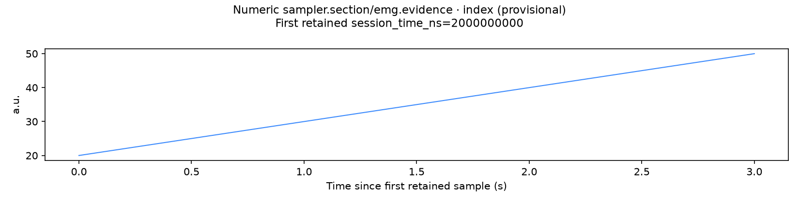

# Current numeric consumer × closing checkpoint sections

This is a focused receiving supplement for [CaptureSuite #54](https://github.com/Jacob-Met/CaptureSuite/issues/54), following the integration of the numeric consumer in [PR #49](https://github.com/Jacob-Met/CaptureSuite/pull/49). It qualifies the **unchanged checkpoint repair** on the new actual numeric CLI path. It adds no production source change.

## Exact source and execution

The receiving main is **0ed1ccaa023a5327495565d59e1dd0b28b2ee5bd**, tree **b8990a709744eab58b25b875596c79d0865cce4a**, with all **812 Git blobs** materialized in two isolated native worktrees. The baseline retains the original windows.py blob **80bea6bd69365a48c5b204c26d054b8ae179437a**. The candidate differs in exactly that file, using the already frozen repair:

- Git blob: **aaafd8db78f82a5a56178135dbed5bfd4f45c634**
- SHA-256: **5cf401b7b7d201225c966b804cfff39c3f6d59669da7e488dd68c4253a829c32**
- Original implementation commit: **4fcd0aa4319b6594af637af8644c187fcbff3cf5**

The numeric registry, loader, features, handler, plotting helper, job lifecycle, QC, report renderer, schemas and dependencies retain current-main bytes. All 812 file identities were checked before and after each execution and again during assessment. The local receiving transfer also compared every original path, mode and blob in all four snapshots with the independently fetched GitHub tree. Eight Windows command/script files in each native checkout were restored from checkout CRLF to their exact canonical Git bytes before freezing; their recorded before/after hashes are in [source-intake.json](source-intake.json).

Exactly **two production CLI processes** ran on native macOS 26.6.2 / arm64, using the existing private Python 3.12.8 environment. The commands were the normal entrypoint with:

~~~text
python tools/run_analysis.py all PACKAGE \
  --checkpoint-section trial --sources sampler.section \
  --strict-warnings --overwrite-job-id numeric-checkpoint
~~~

Both finished with **exit 0**, status **completed**, and no warnings, using the installed jsonschema 4.26.0 validator. Runs began at 13:27:06 UTC and 13:27:25 UTC on 2026-10-08 and each took approximately 20 seconds. No additional production rerun or replay of the numeric owner's test suites occurred. The receipt-only startup observer records **49 actual application module entries** per process; it does not replace an application function, loader, transport, feature computation or output. Those module files were also verified after execution.

## Persisted fixture and observed result

The fixture has 81 real protobuf numeric frames in two MCAP messages. Frame index *i* has value *i* and derived session timestamp *i × 100,000,000 ns*. The second message starts at session time 4 seconds with a distinct native device-clock epoch. Its descriptive modality is **emg**, while its wire schema is **generic.numeric_batch/1** and MCAP schema name is **capture.v1.data.NumericBatch**. Thus real schema-first dispatch must select the numeric consumer.

The persisted checkpoint file is deliberately unsorted: Finish at 7 seconds, selected Trial at 5 seconds, and Warmup at 2 seconds. Trial names the section closed by that checkpoint.

| Actual output | Current resolver | Frozen correction |
|---|---:|---:|
| Manifest and sync interval | 5–7 seconds | **2–5 seconds** |
| Inclusive retained sample indices | 50–70 | **20–50** |
| Retained samples | 21 | **31** |
| Complete numeric feature windows | 3 | **5** |
| Window means, displayed compactly | 54.5, 59.5, 64.5 | **24.5, 29.5, 34.5, 39.5, 44.5** |
| Closed-section behavioral checks | 5 failures | **5 passes** |
| Final scoped assessment | 8 pass / 5 fail | **13 pass / 0 fail** |

The exact unrounded values, timestamps, selected checkpoint ID and source identity are retained in [final-assessment.json](final-assessment.json), both original job manifests, sync JSON and Parquet/CSV outputs. Complete feature windows use the numeric consumer's existing sample-count rule. The last retained boundary sample need not form another complete feature window.

All **nine raw package files**, including the original MCAP, native timestamps, checkpoint order and values, descriptors and integrity record, stayed byte-identical. Both jobs emitted the actual numeric table, CSV mirror, schema metadata, numeric figure and shared sync products. Every one of the **nine non-self output entries** matched its recorded byte count and SHA-256.

## Actual rendered output

The existing numeric plot correctly names elapsed time and exposes its exact first-retained session origin. These are original matplotlib outputs, inspected directly without image alteration.

This numeric axis behavior is distinct from the separately reported legacy IMU axis-label limitation. No plotting source was changed here.

## Original checker failure and bounded assessment

The first receiver's blanket output check also demanded a final self-consistent digest from job_manifest.json. Existing jobs.py writes that self-entry from a preliminary manifest and then rewrites the manifest. The numeric owner's maintained assert_artifacts receiver already observes this entry separately.

Consequently the original post-run checker reports **7 pass / 6 fail** on the baseline and **12 pass / 1 fail** on the candidate, although both actual CLI processes exited 0. That first checker result, traceback, source, original manifests and actual final hashes are preserved unchanged in [summary.json](summary.json), [runner.log](runner.log) and the native archive.

[drivers/assess.py](drivers/assess.py) then read the retained results without executing the application again. It applied the existing non-self artifact contract, recorded each preliminary self-entry and the actual final manifest hash separately, verified the selected manifest fields and all source hashes, and produced the scoped 8/5 versus 13/0 assessment above. This is an explicit correction to the receiving assumption, not a claim that the manifest self-entry is a valid final file digest. No product output or original receipt was rewritten.

A remote path-validation timeout also prevented the first collection-script upload; the attempted packager could not open that absent script. The bounded upload retry succeeded. This was packaging only, after both production executions and assessment, and did not change any tested source or output.

## Complete evidence

[native-packet.tar.gz](native-packet.tar.gz) retains **73 payload files / 1,374,096 bytes**, plus its own manifest: all raw seed and per-run session files, complete derived jobs, original and final assessments, stdout/stderr, import traces, four full source manifests, frozen overlay, exact drivers and dependency receipt. Only disposable matplotlib caches and the separately retained complete source worktrees are omitted.

Archive: **444,619 bytes**, SHA-256 **15e947f9f675d8d91b551b6d47b24346ce34ce52bd7adfe94bcdbd78b3a468f4**. Every payload member was verified natively and again after transfer. [transfer-receipt.json](transfer-receipt.json) records that custody and the independent 812-file GitHub-tree comparison. The original receiving root remains /Users/me/capturesuite-checkpoint-18a24bf0c281/numeric-composition-0ed1.

The frozen native driver is [drivers/receive.py](drivers/receive.py), SHA-256 **6f976f98c99117acb8b36faad1a9cea4402b2422969aca4ed4dff50234448b10**. It refuses to reuse an existing receiving source directory; reproducing it requires a fresh isolated destination and the pinned source repository, frozen windows file and observer layout retained in the archive. The assessment is separately reproducible over extracted retained output with the bound source worktrees available.

This evidence qualifies this exact synthetic numeric/checkpoint composition. Earlier IMU, boundary and independent future-isolation results remain at their own frozen sources. No hardware calibration, physical capture, production installation or broad current-tree test result is inferred.
