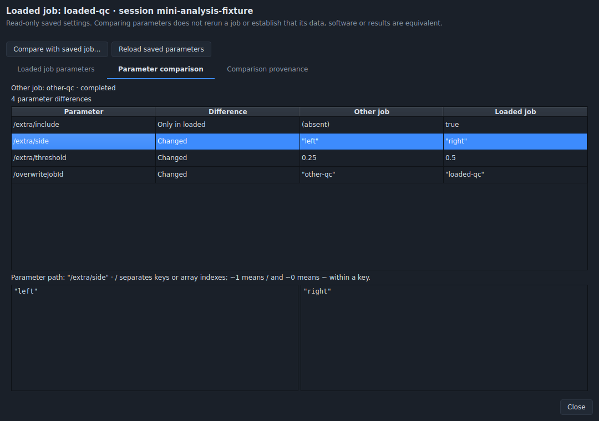
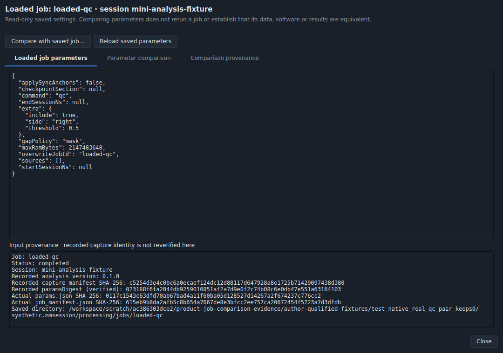

# Saved analysis parameter inspection and comparison — receiving record

Issue [#70](https://github.com/Jacob-Met/CaptureSuite/issues/70) implements
the parameter inspection/comparison part of Analysis Workbench §6. A completed
job's native Job inspector opens read-only saved parameters, compares another
same-session sibling, and exposes typed differences and truthful provenance.
[Operator behavior and limits](../../design/research/JOB_PARAMETER_COMPARISON.md)
describe the complete contract.

The first published head's actual Windows gate found two retry/reload failures.
The [portable reader correction](windows-reader-correction.md) preserves that
complete negative and records the bounded successor. Earlier native results
below retain their original source and runtime attribution; they do not qualify
the corrected reader or replace its fresh Windows gate.

The implementation contributor is `chatgpt-ac386303dce2/product_execution`.
The native claim was recorded before edits; notices on history #55 and gallery
#64 preserve their separate source ownership. The source fence consists of two
new desktop modules, narrow JobInspector construction/clear/load hooks, tests
and documentation. FigureGallery, SyncDashboardView, history, source/time
selection, job writers, schemas and numerical code are preserved.

## Original publication runtime source

The original canonical source is
`30de2119699d49d6108fc57f2816b7c32615f7eb`. Its JobInspector shared-module
Git blob is `2d6cbf65e20a9ec813254f380b51cebe203647b4`.

| Original published component | Git blob | SHA-256 |
| --- | --- | --- |
| `analysis_job_comparison.py` | `ec2f2695a3982bf262bea58b4e8f39cd0f74303f` | `db744e872ed3f4dfa7d1bd253aa1e4610032e973e31f91a001cc964a0b139948` |
| `widgets_analysis_comparison.py` | `e770b14c04fe2e36e98a08913ac8f42baa05e980` | `bd0adca471711350b45702bf7c625b28c348321be43c6eaecd047da33304fc1d` |
| `widgets_analysis_plots.py` | `8938b536f13479a424ffb3cd913a4f3364de8d32` | `3d9e2a5843acf530fbffd4dcb42bccff71822801ce0df0c037a72a3d6e7d07da` |
| `test_analysis_job_comparison.py` | `26b8fe1772fb66552f20a22c00fe53c6e689edbb` | `81e931c5dfe9cd67b3f38117e4e2fd08d1a3b8c395c46cc02ce28839541fbfe0` |

[source-freeze-v2.json](source-freeze-v2.json) also records sizes and the exact
unowned top-level definitions preserved in the shared module. The native dialog
source `bd0adca4` stays byte-identical between the first feature freeze and the
bounded legacy metadata-reader successor.

## Author qualification and retained negatives

| Boundary | Observed result | Retained input/output |
| --- | --- | --- |
| Original native JobInspector, actual QC output | No parameter/comparison action was present; source and package unchanged | `baseline-absence.json`, original source and synthetic QC package |
| First author qualification | 41 passed | `author-first.xml`; the pre-overflow helper is retained separately |
| Coherent manifest containing `1e999` | Original helper incorrectly accepted a non-finite decoded value: 1 failure | `manifest-overflow-original.xml`, exact original helper |
| First feature freeze `31386c3b` / `bd0adca4` / `44290df4` | 43 passed, zero skipped, including the actual QC producer pair | `author-qualified.xml`, exact frozen v1 source and retained package |
| Legacy JobInspector wrapper `44290df4` | 3 failures and 2 passing malformed-shape controls | `legacy-wrapper-original.xml`, exact frozen v1 source |
| Final metadata-reader successor `db744e87` / `bd0adca4` / `3d9e2a58` | 46 passed, zero skipped; one producer case deliberately deselected in this bounded replay | `wrapper-qualified.json`, complete console log, JUnit and pre/post source hashes |
| Final wrapper reading the retained actual QC pair | Native actions and all four expected differences passed; all 23 original package files unchanged | `retained-qc-pair-v2.json`, executed method, actual image and retained package |

The legacy negatives are distinct observed behaviors. Invalid UTF-8 escaped the
old load callback. A deeply nested object without the required job identity was
accepted for ordinary metadata display in that runtime. A linked manifest was
read for ordinary display after the parameter bar had refused it. The deep
input is **not** reported as an observed recursion exception. The successor
routes the ordinary inspector through the bounded manifest reader and preserves
valid failed-job metadata/output labels even without saved parameters.

The final author test module contains 45 new cases. The local 46-pass successor
invocation contains 44 of those and two existing Workbench controls; the actual
QC producer case is the single deliberate deselection. It remains unchanged in
the published module for the existing full Windows workflow. The final local
native receiving reads the already produced pair rather than executing another
optional producer run.

Native receiving uses Python 3.12.14 and PySide6/Qt 6.11.2 in offscreen mode.
Qt buttons, keyboard selection, table/value panes, clear/reload and rendering
are real. The operating system directory chooser's returned path is controlled
in automated receiving. The retained QC data comes from the bundled synthetic
mini-session; example `extra` fields exercise saved-document comparison and
are not represented as implemented QC thresholds or physical measurements.

## Exact author evidence

[author-receiving.json.gz](author-receiving.json.gz) is a lossless JSON capsule
with 74 individually hashed members. It retains original source, both feature
freezes, all original/final JUnit results, the complete final-wrapper console
log, source/directory binding receipts, original and paired QC packages, native
images, the executed replay method, current-source inventory and coordination.

| Object | Bytes | SHA-256 |
| --- | ---: | --- |
| Compressed author capsule | 392,120 | `1112f52d6b7e9151586dcdda392c0e837aad3159013037fd15f3f76ba476fec2` |
| Decoded capsule JSON | 894,434 | `05b38bb3dc5159bbb34fb006f75c923ef28e71ac41bc656da30628493246a056` |

[author-receiving-index.json](author-receiving-index.json) maps every member
path to its exact length and digest. Each capsule member has `encoding: base64`;
decode its `content` field and verify `bytes` and `sha256` before use. Extraction
should create a fresh receiving directory and must not overwrite this accepted
record. The readable [retained-pair method](receive-retained-qc-pair.py) differs
from the capsule's executed original only by the required SPDX comment header.
Its runtime statements are unchanged.

The capsule's source inventory records current intake
`58157fdc1b83a12bb4856ef14b0498cf524a1087`, Git tree
`51c711928a28dc02e100fcdea44cd34512318113`, after the separately accepted
manifest finalization and external prediction evaluator. All 577 unaffected
materialized non-evidence leaves match; the two intentional existing changes
are JobInspector and additive PROGRESS. The complete current upstream evidence
is carried through the canonical Git tree rather than a partial local Git
materialization. The old retained QC pair remains attributed to its actual
producer; this source intake does not relabel it as a later producer run.

The subsequent [current-parent composition](current-parent-composition.json)
receives `9c44354cb101c76beff79265de0040b6839d249f`, Git tree
`50cd83ef270467490b15f74639413d238aaa15c6`, after the independently owned
checkpoint-sections and camera-qualification merges. It retains all 583
unaffected materialized non-evidence leaves, the complete current progress
document, and all remaining upstream evidence through the canonical Git tree.
The four frozen comparison production/test blobs and the author capsule above
remain unchanged. The added upstream camera workflow retains its own path
filter; this comparison-only contribution does not select that workflow.

The final publication parent is the documentation-only successor
`a2fd6c58ccc97c7262b97570a85d8aae8dfb978c`, tree
`9cb6f200bece07bbed86b166d659026fcfaf632f`. Its 38 new Mac session-doctor
receiving files and complete progress insertion are retained; no runtime,
test or workflow blob changes in that last intake. The composition record
keeps both the intermediate source intake and this final parent explicit.

Current manifests without a self-entry and older manifests with a historical
self-entry are both supported. The viewer verifies `params.json` and canonical
`paramsDigest`, computes an actual manifest-file digest, and labels capture
identity/version values as recorded rather than independently reverified.

## Native presentation

The final wrapper's actual rendered comparison shows four differences and the
complete selected values. No diagram or mock screenshot substitutes for this
native view.

The parameter tab was rendered on the first feature freeze. Its UI module is
the same `bd0adca4` retained in the final source; this image keeps that original
source attribution.

## Independent and hosted receiving

Root independently inspected the complete helper/dialog, exact bounded-wrapper
delta and both actual native images, and accepted the frozen final source.
Its corrected native probe passes 16/16 behavioral cases on both retained v1
and final v2, with zero skips. A separate inspector-wrapper probe records three
original failures and two passing controls, then passes all five cases on v2.
Those cases cover the original UTF-8 exception, oversized and linked manifest
display, and preservation of failed-job and opaque nested metadata.

The receiver history remains explicit. Its original driver used Return on a
nondefault QPushButton and could not open the dialog; a separate native button
control showed Return emitted zero clicks and Space emitted one. Correcting
that one driver key allowed the unchanged behavioral assertions to run. A
blanket deep-manifest rejection expectation was also outside the parameter
tree contract; valid opaque metadata is retained. Those receiver corrections
are not attributed to production fixes, and their original receipts remain
part of the independent evidence.

The independent [qualification](root/QUALIFICATION.md),
[capsule](root/independent-receiving.json.gz) and
[manifest](root/independent-receiving-manifest.json) are adopted unchanged.
All 37 members, totalling 551,509 original bytes, were independently decoded
and checked against their length, SHA-256 and Git-blob identity after copying.
The compressed capsule is 297,967 bytes with SHA-256
`19d2dac40035df242baa25c057e5fe2b21b2fdcead118aa8991d2238f4a1e704`;
its decoded JSON is 743,906 bytes with SHA-256
`4cabe35811a80a83472e8d5f228c36bb3e880cab82cfb7b97f08ffddbf6d5780`.
The accepting qualification's SHA-256 is
`41ce1fa2dffd725008acdee81c5e2ddd54b5829c0c35b6a938452bc9d3b290b5`.

Independent native receiving and actual published-head Windows checks remain
separate from the author results above. The existing Windows workflow executes
the full test module, including the real QC producer against the current writer,
and records test-process exit, JUnit counts and source hashes. No workflow,
dependency, schema or backend repair is introduced by this feature.

Installed desktop adoption, daemon/hardware operation and scientific validity
are outside this bounded parameter-viewer qualification.
