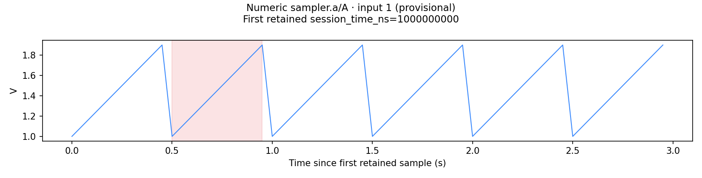
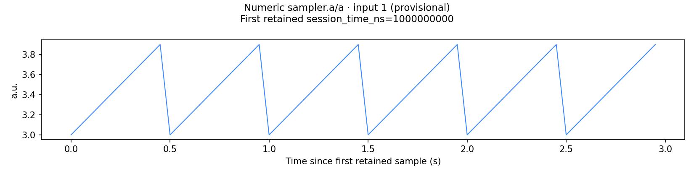

# Independent numeric CLI receiving — 2026-10-08

Receiver: `estate-e82707f2bc62/runtime_discovery`, distinct from the numeric implementation author and numerical loader/timebase/RAM receiver. Coordination: CaptureSuite issue #43. This receiver edited only its independent test and evidence files.

## Qualification stages

| Source | Local receiving | Scope |
|---|---|---|
| Current main `52203f5ceedfa0da8f1813e700a41ec8c364263e` | 7 methods: 5 product failures, 2 passing controls | 8 actual CLI processes; numeric outputs/refusal reporting absent |
| Author-confirmed five-file numeric snapshot | 7 methods: all passed | Same test bytes and 8 actual CLI processes |
| Six-file successor with numeric elapsed-axis/origin labels | 1 affected method: passed | One actual `all` process plus direct inspection of both resulting A/a PNGs |
| Published final source | Hosted CI pending when this receipt was written | Full reusable suite, real installed schema validator and all existing repository gates |

The complete seven-case result remains bound to its original snapshot. The label-only follow-up did not rerun unchanged refusal, QC or source-selection cases. Exact source and test hashes are in `receiving.json` and `axis-followup.json`; the independent test is `tests/analysis/test_numeric_cli_receiving.py`, SHA256 `5d5e7105330d31c8f8e9cbb624641808703a719d62a3674ad69faf1f08d18f22`.

The isolated source composition includes all 57 selected current-main library, CLI, instruction and schema files verified against Git blobs, then the author's named numeric changes and the independent test. The merged stream-gap fix is preserved. All selected source files remain unchanged during both receiving stages.

## Actual user workflows

- `all` discovers three real protobuf NumericBatch MCAP streams with numeric, EMG and EEG descriptive modalities and produces numeric tables, per-stream channel PNGs, a sync dashboard and its data series.
- `features --sources sampler.a` produces two independent tables for that source. The other source produces no feature table.
- `plots --sources sampler.b` produces that stream's actual channel figure and sync dashboard.
- A malformed numeric stream is refused while healthy siblings produce their products. The ordinary command exits 0 with an explicit job warning; `--strict-warnings` exits 2.
- The unchanged QC control produces its inventory JSON/HTML and job log. A missing package exits 1, emits `FAIL`, and creates no job.
- Every declared feature/figure/params/QC artifact resolves inside the job, and its size and SHA256 match the actual file. The inherited manifest self-entry is explicitly excluded for the reason below.
- Raw MCAP, source descriptors, health records, capture metadata and events remain byte-identical after every actual process.

## Separate stream identity, validity and visible time origin

Descriptor IDs `A` and `a` are stored in independent physical stream directories. Their output names remain distinct after case folding, and the UTF-8 hex components decode to their original source/stream IDs. Those original identities and each stream's `validFraction` also persist in `features/_schema.json`. A recorded gap gives stream `A` validity `0.8333333333333334`; healthy `a` remains `1.0`.

Direct inspection of the final native PNGs confirms correct source/stream identity, descriptor units, provisional labels and gap shading only on `A`. The x axis now says **Time since first retained sample (s)**, and the title records **First retained session_time_ns=1000000000**. This states an elapsed-time axis with its exact session origin. It does not claim that the axis itself became absolute session time.

The shared plotting helper adds a backwards-compatible optional axis label; existing callers retain their default. The numeric loader, feature calculations, registry and manifest bytes are identical between the complete five-file receiving and the label successor.

## Local validator boundary

Real MCAP, protobuf, PyArrow and plotting libraries are available in the scoped local runtime. `jsonschema` is unavailable; a normal-index install returned no matching distribution. Both exact repository schemas remain present, and no validator, handler, loader or writer was replaced.

Local receiving uses an explicit `CAPTURE_CLI_ALLOW_MISSING_VALIDATOR=1` test flag permitting only the exact warning `manifest schema validation: No module named 'jsonschema'`. A healthy strict local job therefore exits 2. The native test defaults to requiring the real validator and both schema documents, and hosted CI must establish clean strict success on the published source. No clean strict-success result is claimed from the local runs.

The reusable test uses ordinary unittest methods and `TemporaryDirectory` under normal pytest collection. Optional local receipt directories are not enabled in hosted CI. No reporting subtests or replacement job handlers are used.

## Inherited behavior kept explicit

Untouched current-main `jobs.py` records a preliminary manifest self-entry, so that entry's size/hash differ from the final manifest. Its `logs/job.log` exists but is absent from the persisted output list. Existing QC HTML is an inventory page without feature/figure links; those artifact paths are in the manifest. These findings are reserved for the existing jobs owner; at receipt time the external handoff is pending the write cooldown. They are not claimed fixed by the numeric change.

The internal source-level coverage map is not persisted by existing `jobs.py`. This receipt checks each stream's actual persisted schema coverage and does not claim an exported aggregate. Numerical estimator, native timestamp and RAM qualification belongs to the separate numerical receiver. No physical device, export flow, installed estate host or rollout is included.

## Evidence

- `receiving.json`: complete baseline/five-file receiving records, exact hashes and the final follow-up link.
- `baseline-v1.log`: five product failures and two passing controls.
- `candidate-v1.log`: seven passing methods at the five-file source freeze.
- `axis-followup.log` and `axis-followup.json`: one affected actual CLI process at the six-file composition, raw/source preservation and direct PNG checks.
- `figures/`: copies of the actual final native PNGs, without image editing.
